# Ciao, sono Domiziano De Santis 👋

🔭 **Backend Developer Specializzato** in architetture distribuite e sistemi ad alta scalabilità  
🚀 Competenze chiave: `Spring Cloud` • `Apache Kafka` • `Design Pattern` • `PostgreSQL`  
🌱 Attualmente approfondisco: **Reactive Systems** • **Spring WebFlux** • **Cloud Native Development**  
💡 1.5+ anni di esperienza nello sviluppo enterprise con focus su:
- Microservizi resilienti con circuit breaker
- API RESTful ad alte prestazioni
- Integrazione di sistemi event-driven
- Ottimizzazione query SQL/NoSQL

🎯 Prossima frontiera: Esplorare **C++/Unreal Engine 5** per gaming backend • Certificazione **AWS Certified Developer**

---

## 🛠️ Tech Stack

### Backend

### Frontend

### Tools

---

## 🗺️ Roadmap Competenze (Template)

```mermaid
%%{init: {'theme': 'dark', 'themeVariables': { 'primaryColor': '#6DB33F', 'edgeLabelBackground':'#1E1E1E'}}}%%
flowchart TD
    subgraph Fondamenta
        A[Java 17+ 🍵]
        B[Spring Core 🌱]
        C[Design Patterns 🧩]
        D[PostgreSQL 🐘]
    end

    subgraph Competenze_Attuali["💼 Competenze Attuali"]
        E[Spring Boot 3 🚀]
        F[Hibernate 💾]
        G[REST APIs 🔄]
        H[Docker 🐳]
        I[Spring Cloud ☁️]
        J[Apache Kafka 📡]
        K[Microservizi 🧪]
    end

    subgraph Prossimi_Obiettivi["🎯 Prossimi Obiettivi (2024)"]
        L[Reactive Programming ⚡]
        M[Spring WebFlux 🌊]
    end

    subgraph Futuro["🚀 Futuro (2025+)"]
        N[C++/Unreal Engine 5 🎮]
        O[AWS/GCP ☁️]
        P[Domain-Driven Design 🏰]
        Q[Performance Optimization 🚄]
    end

    A --> E
    B --> E
    E --> I
    I --> K
    H --> K
    J --> K
    G --> L
    L --> M
    D --> F
    F --> G
    C --> P
    K --> O
    M --> Q
    N -.-> Q

    style Fondamenta fill:#2B2D42,stroke:#8D99AE
    style Competenze_Attuali fill:#2D3A3A,stroke:#4A9375
    style Prossimi_Obiettivi fill:#3E2B46,stroke:#8E5A9E
    style Futuro fill:#1E2D2D,stroke:#3D7068
```

